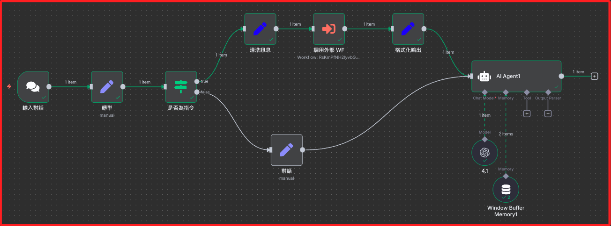
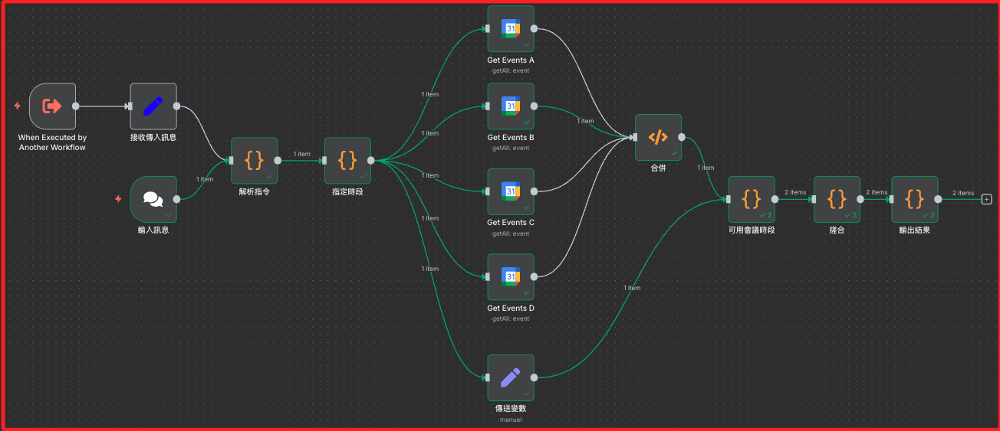
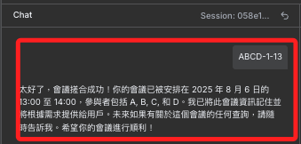
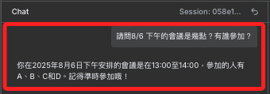

# 透過 AI 代理

_將會議搓合工作流設定為外部工作流_

<br>

## 專案架構

1. 主工作流。

    

<br>

2. 外部工作流。

    

<br>

## 操作步驟

1. 導入基礎容器的環境變數。

    ```bash
    export $(grep -v '^#' ../n8n-docker/.env | xargs)
    ```

<br>

2. 建立功能性變數。

    ```bash
    DOWNLOAD_JSON=project.json
    TMP_JSON="wf_tmp_cleaned.json"
    ```

<br>

3. 清洗。

    ```bash
    jq 'del(.id, .createdAt, .updatedAt, .active, .isArchived, .shared, .tags, .meta, .staticData, .pinData, .versionId, .triggerCount)' "$DOWNLOAD_JSON" \
        | jq 'if .settings == null then .settings = {} else . end' \
        > "$TMP_JSON" && mv "$TMP_JSON" "$DOWNLOAD_JSON"
    ```

<br>

4. 部署為新工作流。

    ```bash
    curl -s -X POST http://localhost:5678/api/v1/workflows \
        -H "X-N8N-API-KEY: ${N8N_API_KEY}" \
        -H "Content-Type: application/json" \
        --data-binary @"$DOWNLOAD_JSON" | jq
    ```

<br>

## 說明

1. 在主工作流中進行對話，有兩種模式，第一是使用指定格式直接下達指令，如 `ABCD-1-13` 代表四人會議，為期 `1` 小時、在下午 `1` 點開始，也就是數字 `13`。

    ```bash
    ABCD-1-13
    ```

    

<br>

2. 必須設置適當的 `prompt` 以及將 `Memory` 節點正確配置 `sessionId`，便可讓代理更好利用歷史對話產生類記憶。

    

<br>

3. 當前 `prompt` 設置。

    ```json
    "options": {
        "systemMessage": "你是一個智能會議助手，專門協助用戶進行會議安排和一般對話。你具有完整的對話記憶能力，能夠記住之前討論過的會議資訊。\n\n**處理規則：**\n\n1. **會議搓合結果回應** (當收到包含「會議搓合結果」的訊息時)：\n   - 仔細分析會議搓合的詳細資訊\n   - 提供友善、詳細的會議安排說明\n   - 包含時間、參與者、狀態等關鍵資訊\n   - 如果成功，恭喜用戶並確認會議詳情\n   - **重要：將會議資訊存入記憶，以便後續查詢**\n\n2. **會議查詢** (當用戶詢問會議相關問題時)：\n   - **優先檢查對話歷史中的會議資訊**\n   - 如果之前討論過相關會議，直接從記憶中提供準確資訊\n   - 包含日期、時間、參與者等詳細內容\n   - 如果沒有相關資訊，說明需要先進行會議搓合\n\n3. **一般對話** (其他所有情況)：\n   - 自然、友善地回應用戶\n   - 可以協助解答問題或進行日常對話\n   - 如果用戶詢問會議相關功能，解釋如何使用 ABCD-時長-起始時間 格式\n\n4. **記憶運用**：\n   - 主動利用對話歷史回答問題\n   - 當用戶詢問「今天」、「明天」、「8/6」等特定日期的會議時，檢查之前的會議搓合結果\n   - 提供準確、具體的會議參與者和時間資訊\n\n5. **回應風格**：\n   - 保持專業但友善的語調\n   - 提供實用的資訊和建議\n   - 維持對話的連續性和上下文理解\n   - 當能從記憶中找到資訊時，要自信地提供準確答案\n\n請根據輸入內容的類型和對話歷史，給出最適合的回應。特別注意利用之前的會議搓合結果來回答後續查詢。"
    }
    ```

<br>

## 備份

1. 主腳本；特別注意，若外部工作流命名變更，要更改 `cachedResultName` 的值。

    ```json
    {
    "name": "WF_AI_Scheduler",
    "nodes": [
        {
            "parameters": {
                "model": {
                    "__rl": true,
                    "value": "gpt-4",
                    "mode": "list",
                    "cachedResultName": "gpt-4"
                },
                "options": {}
            },
            "type": "@n8n/n8n-nodes-langchain.lmChatOpenAi",
            "typeVersion": 1.2,
            "position": [704, 304],
            "id": "5e2ccf52-0e3e-45b4-9246-8fd99890f190",
            "name": "4.1",
            "credentials": {
                "openAiApi": {
                    "id": "JKimMVQo3FbTJyW5",
                    "name": "OpenAi account"
                }
            }
        },
        {
            "parameters": {
                "promptType": "define",
                "text": "={{ $json['message'] }}",
                "hasOutputParser": true,
                "options": {
                "systemMessage": "你是一個智能會議助手，專門協助用戶進行會議安排和一般對話。你具有完整的對話記憶能力，能夠記住之前討論過的會議資訊。\n\n**處理規則：**\n\n1. **會議搓合結果回應** (當收到包含「會議搓合結果」的訊息時)：\n   - 仔細分析會議搓合的詳細資訊\n   - 提供友善、詳細的會議安排說明\n   - 包含時間、參與者、狀態等關鍵資訊\n   - 如果成功，恭喜用戶並確認會議詳情\n   - **重要：將會議資訊存入記憶，以便後續查詢**\n\n2. **會議查詢** (當用戶詢問會議相關問題時)：\n   - **優先檢查對話歷史中的會議資訊**\n   - 如果之前討論過相關會議，直接從記憶中提供準確資訊\n   - 包含日期、時間、參與者等詳細內容\n   - 如果沒有相關資訊，說明需要先進行會議搓合\n\n3. **一般對話** (其他所有情況)：\n   - 自然、友善地回應用戶\n   - 可以協助解答問題或進行日常對話\n   - 如果用戶詢問會議相關功能，解釋如何使用 ABCD-時長-起始時間 格式\n\n4. **記憶運用**：\n   - 主動利用對話歷史回答問題\n   - 當用戶詢問「今天」、「明天」、「8/6」等特定日期的會議時，檢查之前的會議搓合結果\n   - 提供準確、具體的會議參與者和時間資訊\n\n5. **回應風格**：\n   - 保持專業但友善的語調\n   - 提供實用的資訊和建議\n   - 維持對話的連續性和上下文理解\n   - 當能從記憶中找到資訊時，要自信地提供準確答案\n\n請根據輸入內容的類型和對話歷史，給出最適合的回應。特別注意利用之前的會議搓合結果來回答後續查詢。"
                }
            },
            "type": "@n8n/n8n-nodes-langchain.agent",
            "typeVersion": 1.7,
            "position": [704, 64],
            "id": "f460d62d-1143-4882-83bb-ff3771057eb2",
            "name": "AI Agent1"
        },
        {
            "parameters": {
                "sessionIdTemplate": "={{ $json.sessionId || 'default-session' }}",
                "windowSize": 10
            },
            "type": "@n8n/n8n-nodes-langchain.memoryBufferWindow",
            "typeVersion": 1.3,
            "position": [768, 416],
            "id": "53142798-0f56-48a8-803e-23152a2d9334",
            "name": "Window Buffer Memory1"
        },
        {
            "parameters": {
                "options": {}
            },
            "type": "@n8n/n8n-nodes-langchain.chatTrigger",
            "typeVersion": 1.1,
            "position": [-672, 96],
            "id": "912ddc11-c0ea-4499-aa17-ff3ce32b84e6",
            "name": "輸入對話",
            "webhookId": "e0d326c4-c27f-4a40-86ca-05b8776ec8b0"
        },
        {
            "parameters": {
                "assignments": {
                    "assignments": [
                        {
                            "id": "0a678617-cdc1-4a8b-97ab-4fb5ef5c4198",
                            "name": "chatInput",
                            "value": "={{ $json[\"chatInput\"].toString() }}",
                            "type": "string"
                        },
                        {
                            "id": "c5e6ae45-89a2-4061-8b95-f61242063c78",
                            "name": "sessionId",
                            "value": "={{ $json[\"sessionId\"] }}",
                            "type": "string"
                        }
                    ]
                },
                "options": {}
            },
            "type": "n8n-nodes-base.set",
            "typeVersion": 3.4,
            "position": [-448, 96],
            "id": "31a22a7b-2d16-4420-ab9c-3b19f57678f1",
            "name": "轉型"
        },
        {
            "parameters": {
                "conditions": {
                "options": {
                    "caseSensitive": true,
                    "leftValue": "",
                    "typeValidation": "loose",
                    "version": 2
                },
                "conditions": [
                    {
                        "id": "4ac435e9-1b40-40be-b311-3a4aae97f54c",
                        "leftValue": "={{ $json[\"chatInput\"] }}",
                        "rightValue": "^[A-Za-z]+-\\d+-\\d+$",
                        "operator": {
                            "type": "string",
                            "operation": "regex"
                        }
                    }
                ],
                "combinator": "and"
                },
                "looseTypeValidation": true,
                "options": {}
            },
            "type": "n8n-nodes-base.if",
            "typeVersion": 2.2,
            "position": [-224, 96],
            "id": "284c9b77-270a-4ebc-a7fe-912eab9546be",
            "name": "是否為指令"
        },
        {
            "parameters": {
                "values": {
                    "string": [
                            {
                                "name": "message",
                                "value": "={{$json['dynamicMessage'] || 'Default message'}}"
                            },
                        {
                        "name": "sessionId",
                        "value": "={{$json['sessionId'] || $json['chatId'] || $json['id'] || 'No session found'}}"
                        }
                    ]
                },
                "options": {}
            },
            "id": "SetDynamicMessageNode",
            "name": "清洗訊息",
            "type": "n8n-nodes-base.set",
            "typeVersion": 2,
            "position": [16, -80]
        },
        {
            "parameters": {
                "workflowId": {
                    "__rl": true,
                    "value": "RsKmPfNH2IyvbGom",
                    "mode": "list",
                    "cachedResultName": "WF_ScheduleMeeting"
                },
                "workflowInputs": {
                    "mappingMode": "defineBelow",
                    "value": {},
                    "matchingColumns": [],
                    "schema": [],
                    "attemptToConvertTypes": false,
                    "convertFieldsToString": true
                },
                "options": {}
            },
            "type": "n8n-nodes-base.executeWorkflow",
            "typeVersion": 1.2,
            "position": [224, -80],
            "id": "93626e8a-6cd7-48e9-9e00-6b3bc591355b",
            "name": "調用外部 WF"
        },
        {
            "parameters": {
                "values": {
                "string": [
                    {
                    "name": "message",
                    "value": "={{ \n  $json.message ? \n  `會議搓合結果：\n狀態：${$json.message}\n時間：${$json.slotTime || '未指定'}\n參與者數量：${$json.participantCount || 0}\n參與者：${$json.participants || '未指定'}\n搜尋範圍：${$json.searchRange || '未指定'}\n\n[重要] 請記住：8月6日13:00-14:00會議，參與者包括：${$json.participants || '未指定'}。當用戶詢問8/6下午會議時，請直接提供此資訊。` \n  : '會議搓合處理中...'\n}}"
                    },
                    {
                        "name": "sessionId",
                        "value": "={{$('清洗訊息').item.json.sessionId || $json.sessionId || 'No sessionId found'}}"
                    },
                    {
                        "name": "isMatchingResult",
                        "value": "true"
                    },
                    {
                        "name": "originalMessage",
                        "value": "={{$json.message || ''}}"
                    },
                    {
                        "name": "slotTime",
                        "value": "={{$json.slotTime || ''}}"
                    },
                    {
                        "name": "participantCount",
                        "value": "={{$json.participantCount || 0}}"
                    },
                    {
                        "name": "participants",
                        "value": "={{$json.participants || ''}}"
                    }
                ]
                },
                "options": {}
            },
            "id": "FinalOutputNode",
            "name": "格式化輸出",
            "type": "n8n-nodes-base.set",
            "typeVersion": 2,
            "position": [464, -80]
        },
        {
        "parameters": {
            "assignments": {
                "assignments": [
                    {
                        "id": "chat-message-id",
                        "name": "message",
                        "value": "={{ $json[\"chatInput\"] }}",
                        "type": "string"
                    },
                    {
                        "id": "session-id",
                        "name": "sessionId",
                        "value": "={{ $json[\"sessionId\"] }}",
                        "type": "string"
                    },
                    {
                        "id": "chat-type",
                        "name": "isMatchingResult",
                        "value": "false",
                        "type": "string"
                    }
                ]
            },
            "options": {}
        },
        "type": "n8n-nodes-base.set",
        "typeVersion": 3.4,
        "position": [96, 288],
        "id": "prep-for-agent",
        "name": "對話"
        }
    ],
    "connections": {
        "4.1": {
            "ai_languageModel": [
                [
                    {
                        "node": "AI Agent1",
                        "type": "ai_languageModel",
                        "index": 0
                    }
                ]
            ]
        },
        "Window Buffer Memory1": {
            "ai_memory": [
                [
                    {
                        "node": "AI Agent1",
                        "type": "ai_memory",
                        "index": 0
                    }
                ]
            ]
        },
        "輸入對話": {
            "main": [
                [
                    {
                        "node": "轉型",
                        "type": "main",
                        "index": 0
                    }
                ]
            ]
        },
        "轉型": {
            "main": [
                [
                    {
                        "node": "是否為指令",
                        "type": "main",
                        "index": 0
                    }
                ]
            ]
        },
        "是否為指令": {
            "main": [
                [
                    {
                        "node": "清洗訊息",
                        "type": "main",
                        "index": 0
                    }
                ],
                [
                    {
                        "node": "對話",
                        "type": "main",
                        "index": 0
                    }
                ]
            ]
        },
        "清洗訊息": {
            "main": [
                [
                    {
                        "node": "調用外部 WF",
                        "type": "main",
                        "index": 0
                    }
                ]
            ]
        },
        "調用外部 WF": {
            "main": [
                [
                    {
                        "node": "格式化輸出",
                        "type": "main",
                        "index": 0
                    }
                ]
            ]
        },
        "格式化輸出": {
            "main": [
                [
                    {
                        "node": "AI Agent1",
                        "type": "main",
                        "index": 0
                    }
                ]
            ]
        },
        "對話": {
            "main": [
                [
                    {
                        "node": "AI Agent1",
                        "type": "main",
                        "index": 0
                    }
                ]
            ]
        }
    },
    "settings": {
        "executionOrder": "v1"
    }
    }
    ```

<br>

2. 外部工作流。

    ```json
    {
        "name": "WF_ScheduleMeeting",
        "nodes": [
            {
                "parameters": {},
                "id": "StartNode",
                "name": "When Executed by Another Workflow",
                "type": "n8n-nodes-base.executeWorkflowTrigger",
                "typeVersion": 1,
                "position": [144, 448]
            },
            {
                "parameters": {
                    "values": {
                        "string": [
                            {
                                "name": "receivedMessage",
                                "value": "={{ $json['message'] }}來自子工作流"
                            },
                            {
                                "name": "sessionId",
                                "value": "={{ $json['sessionId'] }}測試"
                            }
                        ]
                    },
                    "options": {}
                },
                "id": "SetReceivedMessage",
                "name": "接收傳入訊息",
                "type": "n8n-nodes-base.set",
                "typeVersion": 2,
                "position": [352, 448]
            },
            {
                "parameters": {
                    "jsCode": "const data = $input.first().json;\n\nif (data.error) {\n  return [{\n    json: {\n      message: `❌ 錯誤：${data.error}`,\n      sessionId: data.sessionId\n    }\n  }];\n} else {\n  const slot = data.selectedSlot;\n  const participants = data.participants.join(\", \");\n  const allSlotCount = data.allAvailable?.length ?? 0;\n\n  // 直接從 ISO 字串擷取 yyyy-mm-dd HH:MM\n  function formatISOTime(isoStr) {\n    const [date, time] = isoStr.split(\"T\");\n    const [hour, minute] = time.split(\":\");\n    return `${date.replace(/-/g, \"/\")} ${hour}:${minute}`;\n  }\n\n  return [{\n    json: {\n      message: `✅ 搓合成功`,\n      slotTime: `${formatISOTime(slot.startStr)} ~ ${formatISOTime(slot.endStr)}`,\n      participantCount: data.participantCount,\n      participants: participants,\n      totalAvailableSlots: allSlotCount,\n      searchRange: `${formatISOTime(data.timeMin)} ~ ${formatISOTime(data.timeMax)}`,\n      sessionId: data.sessionId\n    }\n  }];\n}\n"
                },
                "id": "5e637155-303e-4e4d-84a6-f4392c64c889",
                "name": "輸出結果",
                "type": "n8n-nodes-base.code",
                "typeVersion": 1,
                "position": [1920, 640]
            },
            {
                "parameters": {
                    "jsCode": "const data = $input.first().json;\n\n// if (!data.chatInput) {\n//   throw new Error(\"❌ 缺少必要欄位：chatInput\");\n// }\n\nconst parts = data.chatInput.split(\"-\");\nif (parts.length < 1 || parts.length > 3) {\n  throw new Error(\"❌ chatInput 格式錯誤，應為格式如 ABCD 或 ABCD-1 或 ABCD-1-14\");\n}\n\nconst [rawPeople, rawHour, rawStartHour] = parts;\n\nconst participants = rawPeople\n  .toUpperCase()\n  .split(\"\")\n  .filter(p => [\"A\", \"B\", \"C\", \"D\"].includes(p));\n\nconst duration = rawHour ? parseInt(rawHour, 10) : 1;\nconst startHour = rawStartHour ? parseInt(rawStartHour, 10) : 9;\nconst days = 7;\n\nif (\n  participants.length === 0 ||\n  isNaN(duration) || duration <= 0 ||\n  isNaN(startHour) || startHour < 0 || startHour > 23\n) {\n  throw new Error(\"❌ chatInput 欄位值不合法\");\n}\n\nreturn [{\n  json: {\n    sessionId: data.sessionId,\n    participants,\n    duration,\n    startHour,\n    days\n  }\n}];\n"
                },
                "id": "87027837-88cf-4479-901f-0a9cdc7271c7",
                "name": "解析指令",
                "type": "n8n-nodes-base.code",
                "typeVersion": 1,
                "position": [560, 560]
            },
            {
                "parameters": {
                    "operation": "getAll",
                    "calendar": {
                        "mode": "list",
                        "value": "primary"
                    },
                    "returnAll": true,
                    "options": {
                        "timeMin": "={{ $json[\"timeMin\"] }}",
                        "timeMax": "={{ $json[\"timeMax\"] }}",
                        "singleEvents": true
                    }
                },
                "id": "9b63a50a-47af-4637-b86b-40db4172a0d5",
                "name": "Get Events A",
                "type": "n8n-nodes-base.googleCalendar",
                "typeVersion": 1,
                "position": [1088, 288],
                "credentials": {
                    "googleCalendarOAuth2Api": {
                        "id": "5CB4X5cOzP32kSLE",
                        "name": "Google Calendar Credential"
                    }
                }
            },
            {
                "parameters": {
                    "operation": "getAll",
                    "calendar": {
                        "mode": "list",
                        "value": "primary"
                    },
                    "returnAll": true,
                    "options": {
                        "timeMin": "={{ $json[\"timeMin\"] }}",
                        "timeMax": "={{ $json[\"timeMax\"] }}",
                        "singleEvents": true,
                        "orderBy": "startTime"
                    }
                },
                "id": "6e1f7e2a-2d48-458d-abee-8466099e1be0",
                "name": "Get Events B",
                "type": "n8n-nodes-base.googleCalendar",
                "typeVersion": 1,
                "position": [1088, 448],
                "credentials": {
                    "googleCalendarOAuth2Api": {
                        "id": "dQj3F7tfTqiP8a2Y",
                        "name": "Google Calendar Credential B"
                    }
                }
            },
            {
                "parameters": {
                    "operation": "getAll",
                    "calendar": {
                        "mode": "list",
                        "value": "primary"
                    },
                    "returnAll": true,
                    "options": {
                        "timeMin": "={{ $json[\"timeMin\"] }}",
                        "timeMax": "={{ $json[\"timeMax\"] }}",
                        "singleEvents": true
                    }
                },
                "id": "0edd90a0-cd6a-4795-ba9a-6119412ad427",
                "name": "Get Events C",
                "type": "n8n-nodes-base.googleCalendar",
                "typeVersion": 1,
                "position": [1088, 624],
                "credentials": {
                    "googleCalendarOAuth2Api": {
                        "id": "7MbTKzfTnOQTOlzX",
                        "name": "Google Calendar Credential C"
                    }
                }
            },
            {
                "parameters": {
                    "operation": "getAll",
                    "calendar": {
                        "mode": "list",
                        "value": "primary"
                    },
                    "returnAll": true,
                    "options": {
                        "timeMin": "={{ $json[\"timeMin\"] }}",
                        "timeMax": "={{ $json[\"timeMax\"] }}",
                        "singleEvents": true,
                        "orderBy": "startTime"
                    }
                },
                "id": "267ef9ad-ddbd-483c-b727-c46de2814975",
                "name": "Get Events D",
                "type": "n8n-nodes-base.googleCalendar",
                "typeVersion": 1,
                "position": [1088, 800],
                "credentials": {
                    "googleCalendarOAuth2Api": {
                        "id": "8bn8ZGj5dW3nmCu5",
                        "name": "Google Calendar Credential D"
                    }
                }
            },
            {
                "parameters": {
                    "jsCode": "const data = $input.first().json;\n\nconst {\n  slotCandidates,\n  existingEvents = [],\n  participants = [],\n  startHour,\n  duration,\n  days,\n  timeMin,\n  timeMax\n} = data;\n\n// 防呆：slot 陣列檢查\nif (!Array.isArray(slotCandidates)) {\n  return [\n    {\n      json: {\n        message: \"❌ 錯誤：slotCandidates 未提供或不是陣列\",\n        rawInput: data\n      }\n    }\n  ];\n}\n\n// 轉換所有事件為時間戳記（以便之後比對）\nconst normalizedEvents = existingEvents.map(ev => {\n  const start = new Date(ev.start?.dateTime || ev.start).getTime();\n  const end = new Date(ev.end?.dateTime || ev.end).getTime();\n  return { start, end };\n});\n\n// 判斷兩個時段是否重疊\nfunction isOverlap(slot, event) {\n  return slot.start_ts < event.end && slot.end_ts > event.start;\n}\n\n// 將 timeMin 和 timeMax 轉為 timestamp 以便比對 slot 範圍\nconst minTS = new Date(timeMin).getTime();\nconst maxTS = new Date(timeMax).getTime();\n\n// ✅ 篩選出在時間範圍內，且與既有事件無衝突的 slot\nconst availableSlots = slotCandidates.filter(slot => {\n  const start_ts = Number(slot.start_ts);\n  const end_ts = Number(slot.end_ts);\n\n  const inRange = start_ts >= minTS && end_ts <= maxTS;\n\n  const noConflict = !normalizedEvents.some(event =>\n    isOverlap({ start_ts, end_ts }, event)\n  );\n\n  return inRange && noConflict;\n});\n\n// 輸出結果\nif (availableSlots.length === 0) {\n  return [\n    {\n      json: {\n        error: \"NO_AVAILABLE_SLOT\",\n        message: \"❌ 錯誤：無可用時段\",\n        slotCandidates,\n        existingEvents,\n        participants,\n        startHour,\n        duration,\n        days,\n        timeMin,\n        timeMax,\n        sessionId: data.sessionId\n      }\n    }\n  ];\n} else {\n  return [\n    {\n      json: {\n        message: \"✅ 成功搓合時段\",\n        selectedSlot: availableSlots[0],\n        allAvailable: availableSlots,\n        participantCount: participants.length,\n        participants,\n        startHour,\n        duration,\n        days,\n        timeMin,\n        timeMax,\n        sessionId: data.sessionId\n      }\n    }\n  ];\n}\n"
                },
                "id": "395ceaff-705c-4a73-ba13-403d794d2d2b",
                "name": "搓合",
                "type": "n8n-nodes-base.code",
                "typeVersion": 2,
                "position": [1760, 640]
            },
            {
                "parameters": {
                    "functionCode": "// 若不是第一筆 item，就不執行（避免重複執行）\nif ($itemIndex !== 0) {\n  return [];\n}\nconst data = $input.first().json;\nconst params = $items(\"指定時段\")[0].json;\n\nconst eventsA = $items(\"Get Events A\").map(i => ({...i.json, source: \"A\"}));\nconst eventsB = $items(\"Get Events B\").map(i => ({...i.json, source: \"B\"}));\nconst eventsC = $items(\"Get Events C\").map(i => ({...i.json, source: \"C\"}));\nconst eventsD = $items(\"Get Events D\").map(i => ({...i.json, source: \"D\"}));\n\nconst allEvents = [...eventsA, ...eventsB, ...eventsC, ...eventsD].map(ev => ({\n  summary: ev.summary || \"無標題\",\n  start: ev.start?.dateTime || ev.start?.date,\n  end: ev.end?.dateTime || ev.end?.date,\n  id: ev.id,\n  source: ev.source\n}));\n\nreturn [{\n  json: {\n    events: allEvents,\n    startHour: params.startHour,\n    duration: params.duration,\n    days: params.days,\n    participants: params.participants,\n    timeMin: params.timeMin,\n    timeMax: params.timeMax,\n    sessionId: params.sessionId\n  }\n}];\n"
                },
                "id": "dabefafd-f74d-47a5-8a3d-16c7438b734c",
                "name": "合併",
                "type": "n8n-nodes-base.function",
                "typeVersion": 1,
                "position": [1392, 512]
            },
            {
                "parameters": {
                    "jsCode": "const input = $input.first().json;\n\nconst now = new Date();\nconst start = new Date(now);\nstart.setHours(0, 0, 0, 0);\n\nconst end = new Date(now);\nend.setDate(end.getDate() + input.days);\nend.setHours(23, 59, 59, 999);\n\nreturn [\n  {\n    json: {\n      sessionId: input.sessionId,\n      timeMin: start.toISOString(),\n      timeMax: end.toISOString(),\n      participants: input.participants,\n      duration: input.duration,\n      startHour: input.startHour,\n      days: input.days\n    }\n  }\n];\n"
                },
                "type": "n8n-nodes-base.code",
                "typeVersion": 2,
                "position": [752, 560],
                "id": "a5020659-d4ca-4c78-b153-7babc8e2fae9",
                "name": "指定時段"
            },
            {
                "parameters": {
                    "jsCode": "const input = $input.first().json;\n\n// 強制要求參數存在，否則報錯\n// if (typeof input.startHour !== 'number') {\n//   throw new Error(\"❌ 缺少必要參數：startHour\");\n// }\n// if (typeof input.duration !== 'number') {\n//   throw new Error(\"❌ 缺少必要參數：duration\");\n// }\n// if (typeof input.days !== 'number') {\n//   throw new Error(\"❌ 缺少必要參數：days（要產生幾個工作日）\");\n// }\n// if (!Array.isArray(input.events)) {\n//   throw new Error(\"❌ 缺少必要參數：events 必須為陣列\");\n// }\n\nconst startHour = input.startHour;\nconst duration = input.duration;\nconst totalWorkdaysNeeded = input.days;\nconst sessionId = input.sessionId\n// 文字轉時間戳（ms）\nfunction toTimestamp(str) {\n  return new Date(str).getTime();\n}\n\n// 建立指定日的候選時段\nfunction buildSlot(date) {\n  const yyyy = date.getFullYear();\n  const mm = String(date.getMonth() + 1).padStart(2, '0');\n  const dd = String(date.getDate()).padStart(2, '0');\n\n  const startStr = `${yyyy}-${mm}-${dd}T${String(startHour).padStart(2, '0')}:00:00+08:00`;\n  const endHour = startHour + duration;\n  const endStr = `${yyyy}-${mm}-${dd}T${String(endHour).padStart(2, '0')}:00:00+08:00`;\n\n  return {\n    startStr,\n    endStr,\n    start_ts: toTimestamp(startStr),\n    end_ts: toTimestamp(endStr)\n  };\n}\n\n// 建立未來 N 個工作日的候選時段\nconst slotCandidates = [];\nlet date = new Date();\nlet count = 0;\n\nwhile (count < totalWorkdaysNeeded) {\n  date.setDate(date.getDate() + 1);\n  if (date.getDay() !== 0 && date.getDay() !== 6) {\n    slotCandidates.push(buildSlot(new Date(date)));\n    count++;\n  }\n}\n\n// 回傳結構\nreturn [{\n  json: {\n    sessionId,\n    slotCandidates,\n    existingEvents: input.events,\n    participants: input.participants ?? [],\n    startHour,\n    duration,\n    days: totalWorkdaysNeeded,\n    timeMin: slotCandidates[0]?.startStr,\n    timeMax: slotCandidates[slotCandidates.length - 1]?.endStr\n  }\n}];\n"
                },
                "type": "n8n-nodes-base.code",
                "typeVersion": 2,
                "position": [1584, 640],
                "id": "c9391733-8aed-497d-9b17-88f4a6300ab5",
                "name": "可用會議時段"
            },
            {
                "parameters": {
                    "options": {}
                },
                "type": "@n8n/n8n-nodes-langchain.chatTrigger",
                "typeVersion": 1.1,
                "position": [352, 640],
                "id": "e1939e7f-944f-4e6c-842c-a4f2acce8069",
                "name": "輸入訊息",
                "webhookId": "5d39e215-4e16-4ef8-a02f-4889d5f46349"
            },
            {
                "parameters": {
                    "assignments": {
                        "assignments": [
                            {
                                "id": "34050661-54ab-4b53-947c-36650b3ed344",
                                "name": "=sessionId",
                                "value": "={{$json['sessionId']}}",
                                "type": "string"
                            }
                        ]
                    },
                    "options": {}
                },
                "type": "n8n-nodes-base.set",
                "typeVersion": 3.4,
                "position": [1088, 1008],
                "id": "0dbe6d2c-1ee7-497d-8b6a-3419418aa345",
                "name": "傳送變數"
            }
        ],
        "connections": {
            "When Executed by Another Workflow": {
                "main": [
                    [
                        {
                            "node": "接收傳入訊息",
                            "type": "main",
                            "index": 0
                        }
                    ]
                ]
            },
            "解析指令": {
                "main": [
                    [
                        {
                            "node": "指定時段",
                            "type": "main",
                            "index": 0
                        }
                    ]
                ]
            },
            "Get Events A": {
                "main": [
                    [
                        {
                            "node": "合併",
                            "type": "main",
                            "index": 0
                        }
                    ]
                ]
            },
            "Get Events B": {
                "main": [
                    [
                        {
                            "node": "合併",
                            "type": "main",
                            "index": 0
                        }
                    ]
                ]
            },
            "Get Events C": {
                "main": [
                    [
                        {
                            "node": "合併",
                            "type": "main",
                            "index": 0
                        }
                    ]
                ]
            },
            "Get Events D": {
                "main": [
                    [
                        {
                            "node": "合併",
                            "type": "main",
                            "index": 0
                        }
                    ]
                ]
            },
            "搓合": {
                "main": [
                    [
                        {
                            "node": "輸出結果",
                            "type": "main",
                            "index": 0
                        }
                    ]
                ]
            },
            "合併": {
                "main": [
                    [
                        {
                            "node": "可用會議時段",
                            "type": "main",
                            "index": 0
                        }
                    ]
                ]
            },
            "指定時段": {
                "main": [
                    [
                    {
                        "node": "Get Events A",
                        "type": "main",
                        "index": 0
                    },
                    {
                        "node": "Get Events B",
                        "type": "main",
                        "index": 0
                    },
                    {
                        "node": "Get Events C",
                        "type": "main",
                        "index": 0
                    },
                    {
                        "node": "Get Events D",
                        "type": "main",
                        "index": 0
                    },
                    {
                        "node": "傳送變數",
                        "type": "main",
                        "index": 0
                    }
                    ]
                ]
            },
            "可用會議時段": {
                "main": [
                    [
                        {
                            "node": "搓合",
                            "type": "main",
                            "index": 0
                        }
                    ]
                ]
            },
            "接收傳入訊息": {
                "main": [
                    [
                        {
                            "node": "解析指令",
                            "type": "main",
                            "index": 0
                        }
                    ]
                ]
            },
            "輸入訊息": {
                "main": [
                    [
                        {
                            "node": "解析指令",
                            "type": "main",
                            "index": 0
                        }
                    ]
                ]
            },
            "傳送變數": {
                "main": [
                    [
                        {
                            "node": "可用會議時段",
                            "type": "main",
                            "index": 0
                        }
                    ]
                ]
            }
        },
        "settings": {
            "executionOrder": "v0"
        }
    }
    ```

<br>

___

_END_